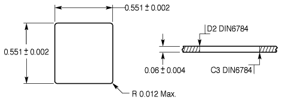
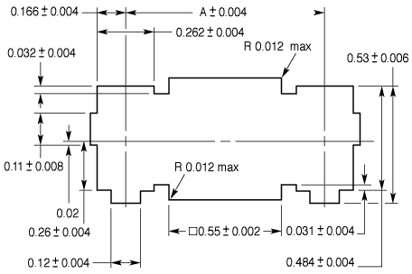
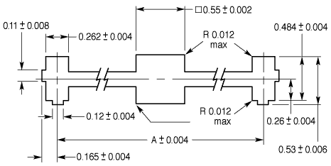

.. image:: yak.png

YAK = "Yet Another Keyboard"

Resources
=========

* http://www.keyboard-layout-editor.com/
* https://github.com/ijprest/keyboard-layout-editor

* http://builder.swillkb.com/
* https://github.com/swill/kb_builder

* http://kalerator.clueboard.co/
* https://github.com/skullydazed/kalerator

* https://github.com/tmk/tmk_keyboard

Plates
======

From http://cherrycorp.com/product/mx-series/

Parts
=====

Switches
--------

Cherry MX

Blue, Clear and Black switches:

* http://www.digikey.ca/product-search/en/switches/pushbutton-switches/1114209?k=cherry%20mx

Blue, Clear, Black and Grey linear switches:

* http://ca.mouser.com/Search/Refine.aspx?Keyword=cherry+mx

Blue, Clear, Black, Green, Brown, Red switches:

http://www.wasdkeyboards.com/index.php/products/keyboard-parts.html

Diodes
------

1N4148

Keycaps
-------

DCS PBT:

* http://www.wasdkeyboards.com/index.php/products/keycap-set/doubleshot-pbt-104-key-cherry-mx-keycap-set-black-slate.html

DCS Extra keys (ABS and PBT depending on stock/colours):

* http://keyshop.pimpmykeyboard.com/products/blank-key-packs/dcs-relegendables

Stabilizers
-----------

PCB mount Cherry (Part number G99-0742):

* http://ca.mouser.com/Search/Refine.aspx?Keyword=cherry+g99
* http://www.gonskeyboardworks.com/10-stabilizers
* http://winkeyless.kr/product/cherry-pcb-mount-stabilizers/
* http://www.digikey.ca/product-search/en?keywords=cherry%20g99

Plate mount Cherry (Part number G99-0224):

* http://ca.mouser.com/Search/Refine.aspx?Keyword=cherry+g99
* http://www.digikey.ca/product-search/en?keywords=cherry%20g99

Plate mount Costar:

* http://www.wasdkeyboards.com/index.php/products/keyboard-parts.html

Stabilizer Bars
---------------

2.0u bars are included with the G99-0742 and G99-0224 parts above.

Ready-made (for 6.25u spacebars and Cherry stabilizers; PCB-only?):

* http://www.gonskeyboardworks.com/stabilizers/90-wire-for-spacebar-stabilizers.html

DIY (Costar and Cherry):

* https://youtu.be/zry3CHNKgT8
* http://shop.dubro.com/p/e-z-bender-wire-forming-tool
* http://hobbyhome.ca/product/ez-bender-wire-forming-tool-sm/
* http://hobbyhome.ca/product/music-wire-36-047-20/
* http://hobbyhome.ca/product/music-wire-36-062116-15/

"Du-Bro E/Z Bender" (DUB480?)
1/16" = 0.0625" = 1.5875mm; #502/#504? Piano Wire (Cherry stabilizer bars)
  26 ga?
3/64" = 0.046875" = 1.190625mm; #5xx? Piano Wire (Costar stabilizer bars)
  21 ga?

"Piano Wire" = "Music Wire"
